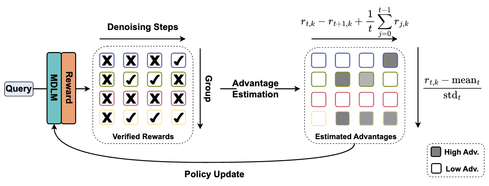

# MDPO: Overcoming the Training-Inference Divide of Masked Diffusion Language Models
[[Paper]](https://arxiv.org/pdf/2508.13148) [[Project]](https://cli212.github.io/MDPO/) 

The code is highly based on [Huggingface OpenR1](https://github.com/huggingface/open-r1). We follow the library ([TRL](https://github.com/huggingface/trl/tree/main)) and the datasets they used. Though TRL is not the most popularly used library for large scale RL for LLM library nowadays. We might consider to transfer to [verl](https://github.com/volcengine/verl/tree/main) at some point.
## 🌟Setup
To prepare the environment, simply run 

```conda create -n py39 python=3.9```

And then 
```CUDA_HOME=$YOUR_CUDA_HOME pip install -e .``` Here we need the CUDA_HOME for Deepspeed and Flashattention compilation.
For the LLaDA model, please use the model defined [here](./src/llada/modeling_llada.py) with ```LLaDAModelLM.from_pretrained('GSAI-ML/LLaDA-8B-Instruct', torch_dtype=torch.bfloat16)``` instead of the huggingface way```AutoModel.from_pretrained('GSAI-ML/LLaDA-8B-Instruct', trust_remote_code=True, torch_dtype=torch.bfloat16)```. Because we made little changes to the huggingface code so that the model, specifically the RoPE embedding supports input mask so we can do batch_size > 1 with prompts of different length.
## 📊Evaluation
For inference experiments, we use the [test_llada.py](./test_llada.py) for MATH-500, and [test_llada_toy_tasks.py](./test_llada_toy_tasks.py) for Countdown which is build on the [original llada generation code](https://github.com/ML-GSAI/LLaDA/blob/main/generate.py).

To run the experiments with Running Confidence Remasking as what we introduce in the paper

```torchrun --nproc_per_node N --master_port 29500 test_llada.py --model_path GSAI-ML/LLaDA-8B-Instruct --mode linear --gen_length 512 --system_prompt_type step_by_step --rcr``` 

You could also log the Answer Backslide live demos as what we show in the [project page](https://cli212.github.io/MDPO/) with "--log_visualizations".
As you might find, surprisingly the simple RCR inference strategy improves comparably to this training method MDPO described below, and it is complementary to further improve MDPO trained models.
## 🚀MDPO
The MDPO algorithm is demonstrated as

where we have a group of rollouts for each query and compute the estimated advantages based on verified rewards for intermediate steps. Please refer to the paper for technical details.

To run training with the same setting as we describe in the paper

```shell
CC=${gcc path} CUDA_HOME=${CUDA_HOME} CXX=${g++ path} accelerate launch --config_file recipes/accelerate_configs/zero2.yaml \
--num_processes 8 src/open_r1/mdpo.py 
--config recipes/LLaDA-Instruct/mdpo/config_demo.yaml 
--dataset_train_split train 
--num_train_epochs 1 
--dataset_name open-r1/OpenR1-Math-220k 
--save_strategy "epoch" 
--output_dir checkpoints/LLaDA-8B-Instruct-MDPO-numina-adv-128st-8sample_temp0.4_Ngpus 
--num_generations N 
--learning_rate 7e-7 
--gradient_accumulation_steps 16 
--temperature 0.4 
--beta 0.02 
--block_length 512 
--max_completion_length 512 
--sample_train_steps 8 
--max_prompt_length 320 
--diffusion_steps 128 
--remask_strategy random 
--num_train_samples 3500 
--system_prompt "Let's think step by step and output the final answer within \\boxed{}."
--incremental_training true
--mixture_data true
```
where N is the number of GPUs you want to use, and you might need to set your gcc and g++ path probably to run on the cluster. Here we only randomly pick 3500 samples from the datasets and it takes ~30 hours to train.
Note that when you turn on "incremental_training", it will start with inference over the training examples first to filter the Answer Backslide samples. And then only the Answer Backslide samples are used to train the model.

## 📚Citation
If you find this work useful, please consider citing our paper. 🥰
```
@misc{he2025MDPO,
      title={MDPO: Overcoming the Training-Inference Divide of Masked Diffusion Language Models}, 
      author={Haoyu He and Katrin Renz and Yong Cao and Andreas Geiger},
      year={2025},
      eprint={2508.13148},
      archivePrefix={arXiv},
      primaryClass={cs.LG},
      url={https://arxiv.org/abs/2508.13148}, 
}
```
